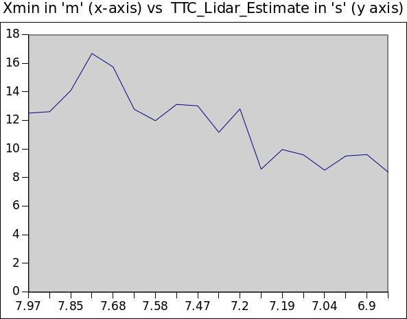
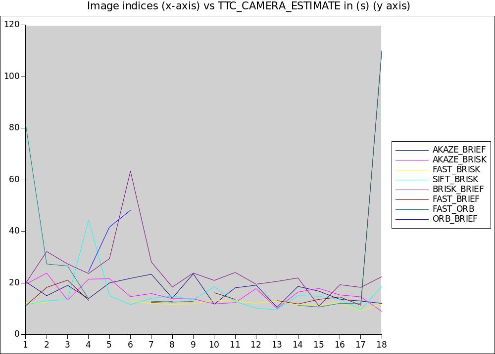

# Sensor Fusion Program - 3rd Project 3D Object Tracking

In the previous project, "2D feature tracking" we used keypoint detectors, descriptors, and implemented methods to match them between successive images. I detected the object in the images using the YOLO deep-learning framework. In this project I associated regions in a camera image with Lidar points in 3D space. 

## Project description
Camera & Lidar for 3D Object Tracking

## Project workflow
These are the major tasks: 

1. First, I developed a way to match 3D objects over time by using keypoint correspondences. 
2. Second, I computed the TTC based on Lidar measurements. 
3. Then combined point cloud data from Lidar, used computer vision, and deep learning to track the moving vehicle in front of the self-driving car and estimated the time to collision (TTC).
4. Object (vehicle) detected using YOLO Neural network through bounding boxes.
5. Object tracking through matching keypoints from 2D feature tracking and bounding boxes across image frames, simultaneously associating regions in images with Lidar points in 3D space.
7. Then, I computed the TTC based on those matches. 
8. And lastly, I conducted various tests with the framework. My goal is to identify the most suitable detector/descriptor combination for TTC estimation and also to search for problems that can lead to faulty measurements by the camera or Lidar sensor. 

## Project Results
*Lidar based TTC*

The time to collision(TTC) is calculated based on the constant velocity model. Therefore, it is calculate by the formula  TTC = (d1 * dT) / (d0 - d1), where d0 and d1 are the disances between the cars measured successively within the time interval dT.

The data from the TTC estimate from the LIDAR is completely decreasing with the decreasing distance between the driven vehicle and the preceding vehicle (i.e. it not showing a completely decreasing TTC trend with respect to decreasing distance X min trend).

We can also observe that, at image frames 5,6,7 the values seems to be plausible as the decreasing distance trend shows a considerable decreasing trend of the TTC estimate which is required for our case. However, in the 8th frame the TTC estimate is greater than the previous estimate though the distance is reduced. This is not a plausible situation. 

This can be made better if we incorporate the acceleration/deceleration characteristics and thereby shifting towards the acceleration based TTC estimate instead of the constant velocity model, as in reality the vehicles in these situations rarely move with constant velocities.

*Camera based TTC*

The computation of the TTC is based on the median distance ratio as explained in the lesson “Estimating TTC with a Camera”. 
TTC = -dT/ (1-medDistRatio)

The combos AKAZE_BRIEF, AKAZE_BRISK, SIFT_BRISK, BRISK_BRIEF seems to give a reasonable TTC_Camera_Estimate. However, even SIFT_BRISK has some unexpected large estimate : 44.42s at image frame 4 and similarly BRISK_BRIEF has a large valueof 63.34 s at image frame 6. Hence, AKAZE_BRIEF, AKAZE_BRISK are somewhat reliable and recommended among these combinations.

The detectors descriptor combos (FAST_BRIEF, FAST_ORB, ORB_BRIEF) are not recommended because of certain unwanted/unreliable estimates because the based on the keypoints detected and described by these combo the median distance ratios will be nearly 1 thus giving “inf” value of TTC.

* Camera & Lidar fusion *

TOP VIEW OF LIDAR POINTS - THESE ARE THE POINTS DESCRIBING THE REAR OF THE PRECEDING VEHICLE 

## Dependencies for Running Locally
* cmake >= 2.8
  * All OSes: [click here for installation instructions](https://cmake.org/install/)
* make >= 4.1 (Linux, Mac), 3.81 (Windows)
  * Linux: make is installed by default on most Linux distros
  * Mac: [install Xcode command line tools to get make](https://developer.apple.com/xcode/features/)
  * Windows: [Click here for installation instructions](http://gnuwin32.sourceforge.net/packages/make.htm)
* OpenCV >= 4.1
  * This must be compiled from source using the `-D OPENCV_ENABLE_NONFREE=ON` cmake flag for testing the SIFT and SURF detectors.
  * The OpenCV 4.1.0 source code can be found [here](https://github.com/opencv/opencv/tree/4.1.0)
* gcc/g++ >= 5.4
  * Linux: gcc / g++ is installed by default on most Linux distros
  * Mac: same deal as make - [install Xcode command line tools](https://developer.apple.com/xcode/features/)
  * Windows: recommend using [MinGW](http://www.mingw.org/)

## Basic Build Instructions

1. Clone this repo.
2. Make a build directory in the top level project directory: `mkdir build && cd build`
3. Compile: `cmake .. && make`
4. Run it: `./3D_object_tracking`.
